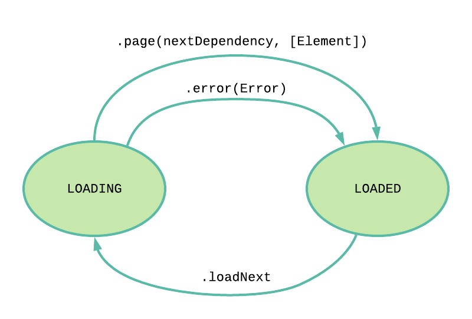

# CombinePaginationFeedback

[](https://github.com/apple/swift-package-manager)

Generic Combine operator to easily interact with paginated APIs. Based on [CombineFeedback](https://github.com/sergdort/CombineFeedback).

## Design



```swift
public typealias PageProvider<PageDependency, Element> = (PageDependency) -> AnyPublisher<Page<PageDependency, Element>, Error>

public static func paginationSystem<PageDependency, Element, S: Scheduler>(
    scheduler: S,
    initialDependency: PageDependency,
    loadNext: AnyPublisher<Void, Never>,
    pageProvider: @escaping PageProvider<PageDependency, Element>
) -> AnyPublisher<PaginationState<PageDependency, Element>, Never>
```

## Features
* Simple state machine to represent pagination use cases.
* Reusable pagination logic. No need to duplicate state across different screens with paginated apis.
* Observe state to react to loading event, latest error and changes on the list of elements.
